# Lashes Room by Riana

Lashes Room by Riana is a fully responsive website created for a beauty business specializing in eyelash extensions. The focus of the website is to provide information about services, showcase work, and promote a healthy beauty routine. With an online presence, it's expected to encourage more clients to choose Riana for their eyelash needs.

## Features

The following features contribute to a seamless user experience by addressing specific user goals. Each feature has been thoughtfully designed to meet user expectations and enhance the website’s usability.

### About Page

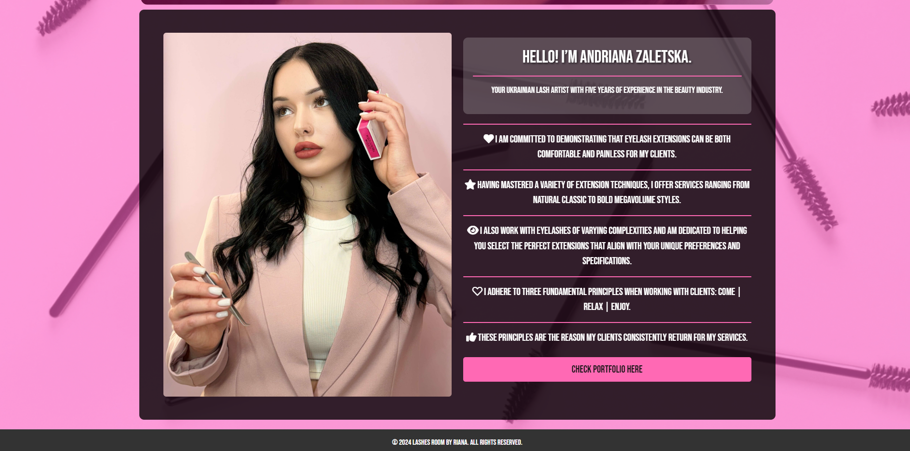

- **Value**: The About page introduces Riana, showcasing her expertise and commitment to quality, which helps build trust with potential clients.
- **User Goals Met**: Frequent users can learn more about Riana’s experience and dedication to quality beauty services.

### Gallery

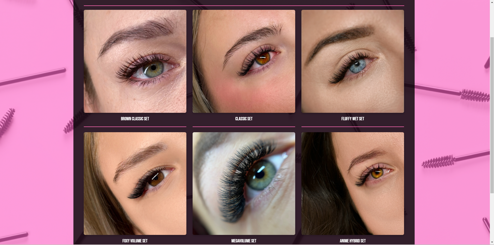

- **Value**: The Gallery provides a visual showcase of Riana's work, helping users assess the quality of services and inspiring confidence in her skills.
- **User Goals Met**: First-time visitors can verify the quality of services, while frequent users can explore new additions to the portfolio.

### Price Page

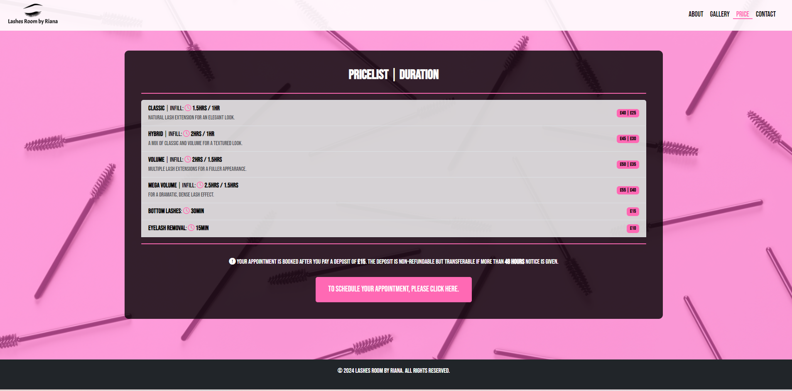

- **Value**: Transparent pricing information helps users make informed decisions before booking an appointment.
- **User Goals Met**: First-time visitors can quickly find detailed pricing information, which adds clarity and trustworthiness to the website.

### Contact Page

- **Value**: The Contact page provides multiple methods for users to get in touch, making it easy to book appointments or ask questions. Social media links are also included for easy access.
- **User Goals Met**: This feature supports both first-time and returning visitors looking to reach out for bookings or inquiries.

## User Experience (UX)

### User Stories

#### 1. First-time Visitor Goals
- As a first-time visitor, I want to understand the purpose of this site and easily navigate through it.
- As a first-time visitor, I want to see pictures of the services offered to confirm their quality.
- As a first-time visitor, I want to see the pricing details for the services offered.
- As a first-time visitor, I want to find information about how to contact the business.

#### 2. Returning Visitor Goals
- As a returning visitor, I want to see updates on services or new promotions.
- As a returning visitor, I want to book an appointment easily.

#### 3. Frequent User Goals
- As a frequent user, I want to view new images from recent work.
- As a frequent user, I want to read new testimonials from clients.

### Design

#### Colour Scheme
- The color scheme chosen for this project features soft pink and purple shades to create a warm and inviting atmosphere that resonates with the beauty industry.

#### Typography
- The primary font used throughout the website is 'Bebas Neue,' providing a modern and stylish look.

#### Imagery
- Large images showcase the eyelash extensions and services offered, helping to attract and engage potential clients. The Gallery page features our own portfolio images.

## Technologies Used

#### Languages Used
- HTML5
- CSS3

#### Frameworks, Libraries & Programs Used
- **[Bootstrap](https://getbootstrap.com/)**: Used for responsive design elements and grid layout, ensuring compatibility across various devices and screen sizes.
- **[Google Fonts](https://fonts.google.com/)**: Used to import the 'Bebas Neue' font into the CSS file.
- **[Font Awesome](https://fontawesome.com/)**: Used for icons throughout the website to enhance visual appeal and user experience.
- **[Git](https://gitpod.io/)**: Used for version control to manage changes and updates to the website.
- **[GitHub](https://github.com/)**: Used to host the project code and track changes.
- **[Balsamiq](https://balsamiq.com/wireframes/)**: Used to create wireframes during the design process.

## Wireframes

Here are the wireframes for the website:

## Testing

### Internal and External Link Testing

| Link                | Action                                                        | Result                                    |
|---------------------|---------------------------------------------------------------|-------------------------------------------|
| Contact Page        | User clicks on the Contact page in the navigation menu       | User is redirected to the Contact page - works as expected |
| About Page          | User clicks on the logo                                        | User is redirected to the About page - works as expected |
| Gallery Page        | User clicks on the Gallery page in the navigation menu       | User is redirected to the Gallery page - works as expected |
| Price Page          | User clicks on the Price page in the navigation menu         | User is redirected to the Price page - works as expected |
| Instagram Link      | User clicks on Instagram link                                 | Redirects to the Instagram page - works as expected |
| Facebook Link       | User clicks on Facebook link                                  | Redirects to the Facebook page - works as expected |
| WhatsApp Link       | User clicks on WhatsApp link                                  | Opens WhatsApp chat - works as expected |

### User Stories / User Acceptance Criteria

#### Understand the site’s purpose and navigate easily:
- **Test**: Verify that the homepage contains a clear introduction and navigational menu options (Home, Gallery, Price, Contact).
- **Result**: Ensure the homepage conveys the purpose of the site effectively and that all menu links navigate to their correct sections.

#### View pictures of services to confirm quality:
- **Test**: Confirm that images of services are displayed prominently on the services page or gallery section.
- **Result**: Images load properly, showcasing the quality of services.

#### See pricing details for services offered:
- **Test**: Check if a pricing section is available and visible on the price page.
- **Result**: Pricing details are clear, and no errors occur while viewing the information.

#### Find contact information:
- **Test**: Confirm that a contact section or page is easily accessible and provides valid phone, email, and address details.
- **Result**: Contact information is displayed correctly and is easy to locate.

### Validation Results
- **HTML Validation**: Each page has been validated using the [W3C Markup Validator](https://validator.w3.org/#validate_by_input) to ensure no syntax errors. Screenshots for validation results are provided below:
  
  .png)
  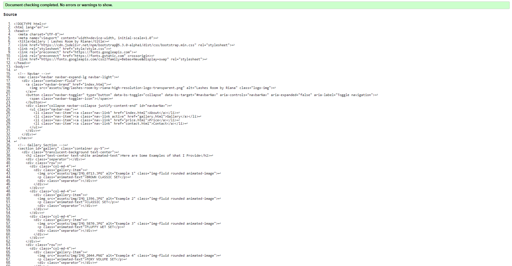
  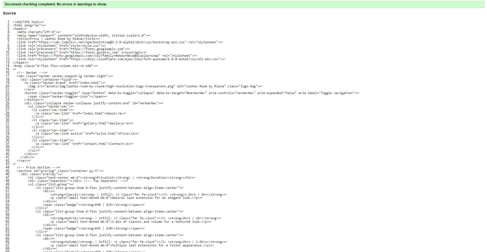
  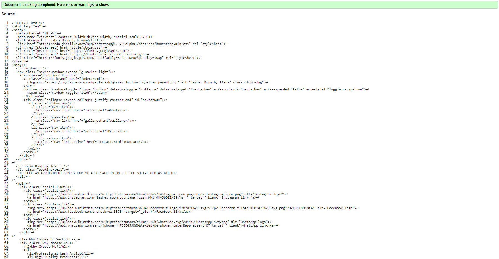
  
- **CSS Validation**: CSS code has been validated through the [W3C CSS Validator](https://jigsaw.w3.org/css-validator/), ensuring the styling adheres to standards.
  
  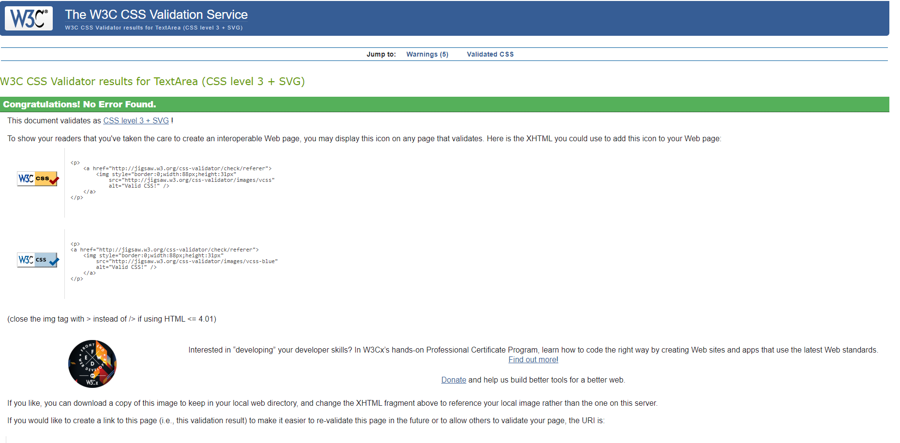

### Performance and Responsiveness Testing

- **Lighthouse Performance Scores**: The website’s Lighthouse scores have been consistently high, showcasing fast load times and good SEO. Screenshots of the performance reports are below:

  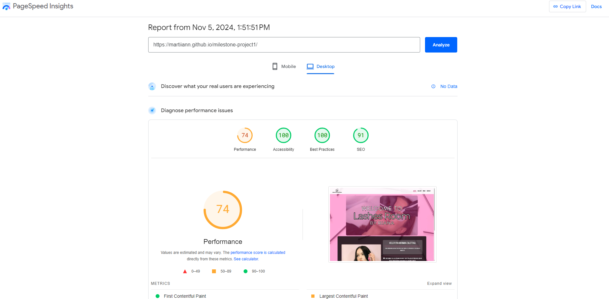
  
- **Responsiveness**: The site has been tested on multiple devices and screen sizes to ensure it is fully responsive. Here are screenshots of the site across devices:

  - **Desktop View**:
    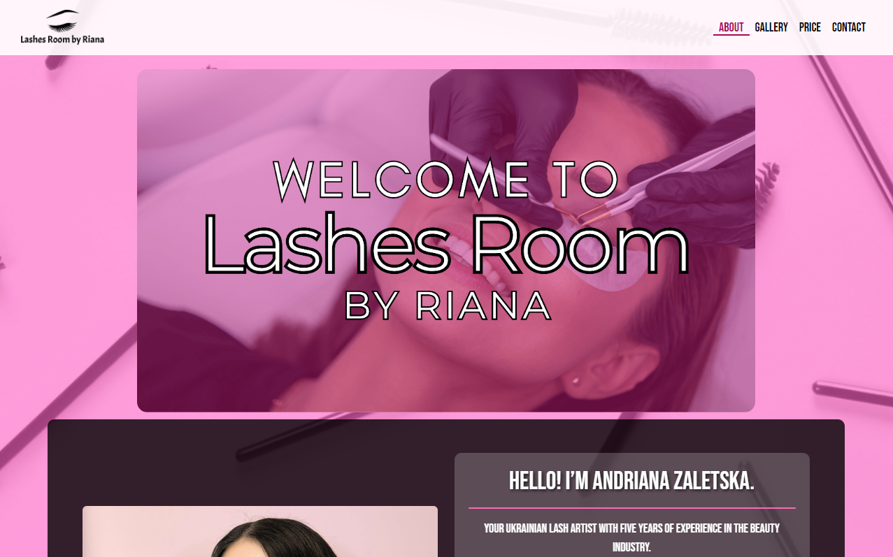

  - **Tablet View**:
    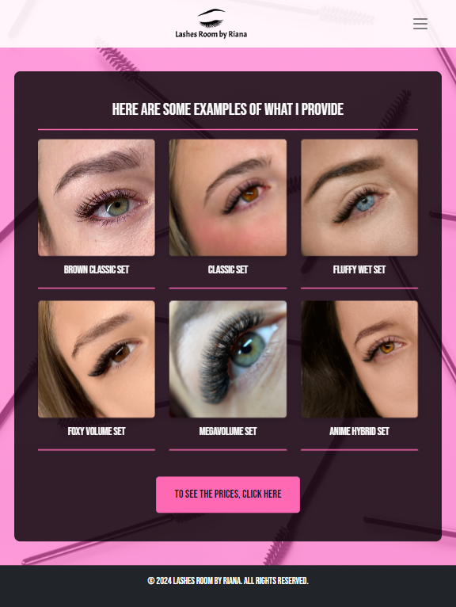

  - **Mobile View**:
    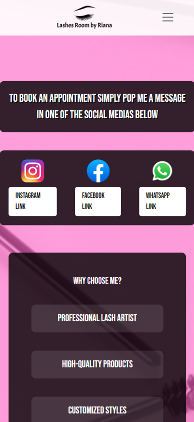

## Debugging
Throughout the development of this website, I conducted extensive debugging to ensure functionality and performance. The following methods were employed:

- **Browser Developer Tools**: Utilized the built-in developer tools in browsers such as Chrome and Firefox to inspect elements, identify errors, and test responsive designs in real-time.
- **Validation Tools**: Employed the [W3C Markup Validator](https://validator.w3.org/) for HTML validation and the [W3C CSS Validator](https://jigsaw.w3.org/css-validator/) for CSS validation, ensuring all code adhered to web standards.
- **Responsive Testing**: Tested the website on various devices and screen sizes to confirm that it is fully responsive, making adjustments where necessary to improve user experience.

## Logo Redirect Fix
The issue where clicking the logo did not redirect to the home page has been resolved. To implement the fix, I ensured that the logo link in the navigation was correctly structured.

## Deployment
- **GitHub Pages**: The website is hosted on GitHub Pages. Follow these steps to deploy:
  1. Log in to GitHub and navigate to your repository.
  2. In the repository settings, scroll to the "GitHub Pages" section.
  3. Select the source branch and save.
  
  The live link for the website can be found [here](https://martiiann.github.io/milestone-project1/).

## Credits
- **Code & Content**: Special thanks to [Stack Overflow](https://www.stackoverflow.com/) and [W3 Schools](https://www.w3schools.com/) for resources.
- **Media**: Images used on the website were sourced from [Unsplash](https://unsplash.com/) and [Pexels](https://www.pexels.com/), as well as showcasing our own portfolio images on the Gallery page.

## Acknowledgments
- Special thanks to my mentors **Marko** and **Moritz** for their invaluable guidance throughout my project.
- I would like to thank the tutor support team at **Code Institute** for their assistance.
- A big thank you to the entire **Code Institute** for providing me with the opportunity to attend this course and work on this project.

