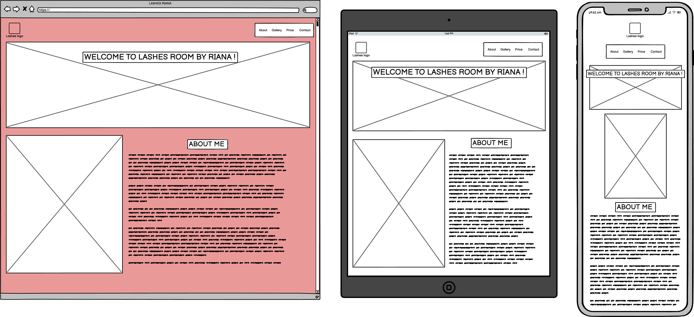
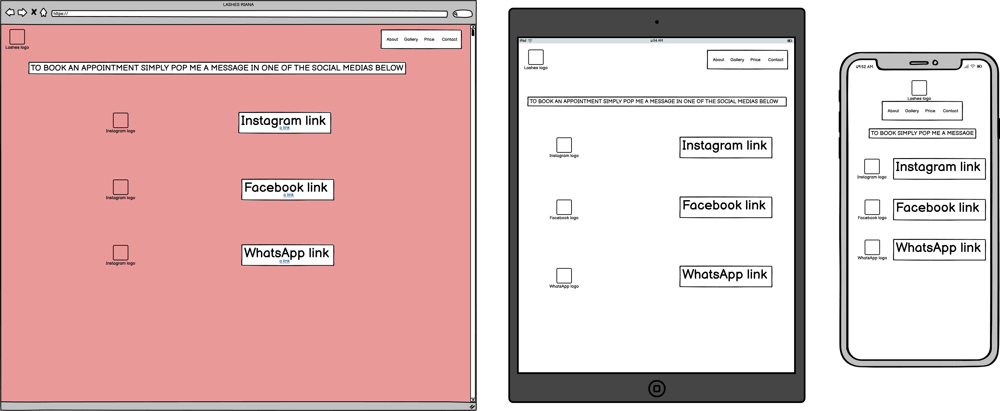
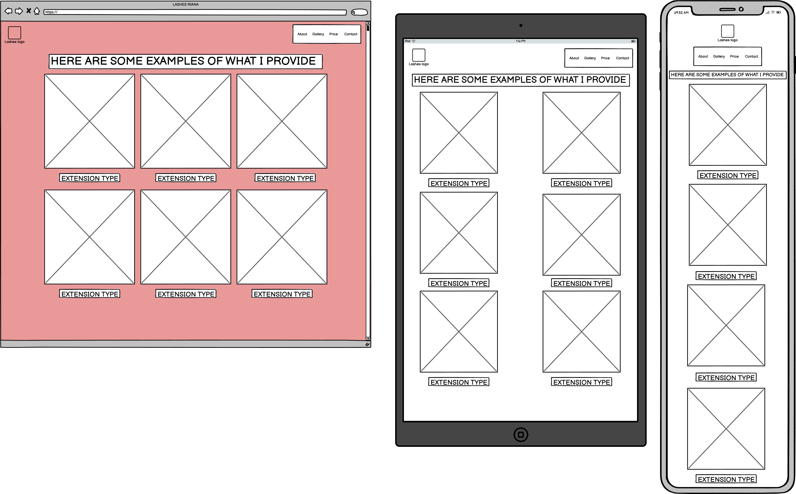
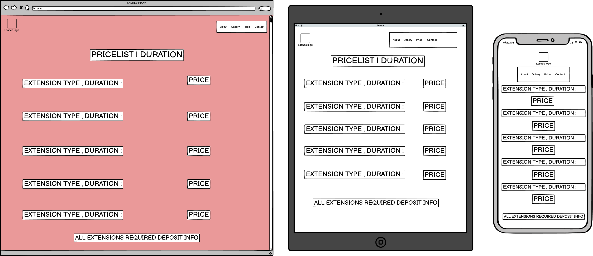

# Lashes Room by Riana

Lashes Room by Riana is a fully responsive website created for a beauty business specializing in eyelash extensions. The focus of the website is to provide information about services, showcase work, and promote a healthy beauty routine. With an online presence, it's expected to encourage more clients to choose Riana for their eyelash needs.

## User Experience (UX)

### User Stories

#### 1. First-time Visitor Goals
- As a first-time visitor, I want to understand the purpose of this site and easily navigate through it.

- As a first-time visitor, I want to see pictures of the services offered to confirm their quality.

- As a first-time visitor, I want to see the pricing details for the services offered.

- As a first-time visitor, I want to find information about how to contact the business.

#### 2. Returning Visitor Goals
- As a returning visitor, I want to see updates on services or new promotions.
- As a returning visitor, I want to book an appointment easily.

#### 3. Frequent User Goals
- As a frequent user, I want to view new images from recent work.
- As a frequent user, I want to read new testimonials from clients.

### Design

#### Colour Scheme
- The color scheme chosen for this project features soft pink and purple shades to create a warm and inviting atmosphere that resonates with the beauty industry.

#### Typography
- The primary font used throughout the website is 'Bebas Neue,' providing a modern and stylish look.

#### Imagery
- Large images showcase the eyelash extensions and services offered, helping to attract and engage potential clients. The Gallery page features our own portfolio images.

### Languages Used
- HTML5
- CSS3

### Frameworks, Libraries & Programs Used
- **[Google Fonts](https://fonts.google.com/)**: Used to import the 'Bebas Neue' font into the CSS file.
- **[Font Awesome](https://fontawesome.com/)**: Used for icons throughout the website to enhance visual appeal and user experience.
- **[Git](https://gitpod.io/)**: Used for version control to manage changes and updates to the website.
- **[GitHub](https://github.com/)**: Used to host the project code and track changes.
- **[Balsamiq](https://balsamiq.com/wireframes/)**: Used to create wireframes during the design process.

## Wireframes

Here are the wireframes for the website:

## Testing
- **HTML Validation**: The HTML code was validated using the [W3C Markup Validator](https://validator.w3.org/) with no errors found.
  
  

- **CSS Validation**: The CSS code was tested using the [W3C CSS Validator](https://jigsaw.w3.org/css-validator/) with no errors found.
  
  

## Debugging
Throughout the development of this website, I conducted extensive debugging to ensure functionality and performance. The following methods were employed:

- **Browser Developer Tools**: Utilized the built-in developer tools in browsers such as Chrome and Firefox to inspect elements, identify errors, and test responsive designs in real-time.
- **Validation Tools**: Employed the [W3C Markup Validator](https://validator.w3.org/) for HTML validation and the [W3C CSS Validator](https://jigsaw.w3.org/css-validator/) for CSS validation, ensuring all code adhered to web standards.
- **Responsive Testing**: Tested the website on various devices and screen sizes to confirm that it is fully responsive, making adjustments where necessary to improve user experience.

Through this process, I was able to enhance the overall functionality and aesthetic of the website, ensuring it meets high standards of quality and performance.

## Features
- **Navigation**: User-friendly menu that provides easy access to all main sections of the website, including About, Gallery, Price, and Contact.
- **About Page**: Introduces Riana, highlighting her experience and services offered, aimed at establishing a personal connection with potential clients.
- **Gallery**: Showcases a curated selection of images demonstrating Riana's work, designed to inspire and attract prospective clients. The Gallery page features our own portfolio images.
- **Price Page**: Provides clear information on services and pricing, helping clients make informed decisions about their appointments.
- **Contact Page**: Features a straightforward contact links for inquiries and appointment bookings, ensuring a seamless communication process.

## Deployment
- **GitHub Pages**: The website is hosted on GitHub Pages. Follow these steps to deploy:
  1. Log in to GitHub and navigate to your repository.
  2. In the repository settings, scroll to the "GitHub Pages" section.
  3. Select the source branch and save.
  
  The live link for the website can be found [here](https://martiiann.github.io/milestone-project1/).

## Credits
- **Code & Content**: Special thanks to [Stack Overflow](https://www.stackoverflow.com/) and [W3 Schools](https://www.w3schools.com/) for resources.
- **Media**: Images used on the website were sourced from [Unsplash](https://unsplash.com/) and [Pexels](https://www.pexels.com/), as well as showcasing our own portfolio images on the Gallery page.

## Acknowledgments
- Special thanks to my mentors **Marko** and **Moritz** for their invaluable guidance throughout my project.
- I would like to thank the tutor support team at **Code Institute** for their assistance.
- A big thank you to the entire **Code Institute** for providing me with the opportunity to attend this course and work on this project.
